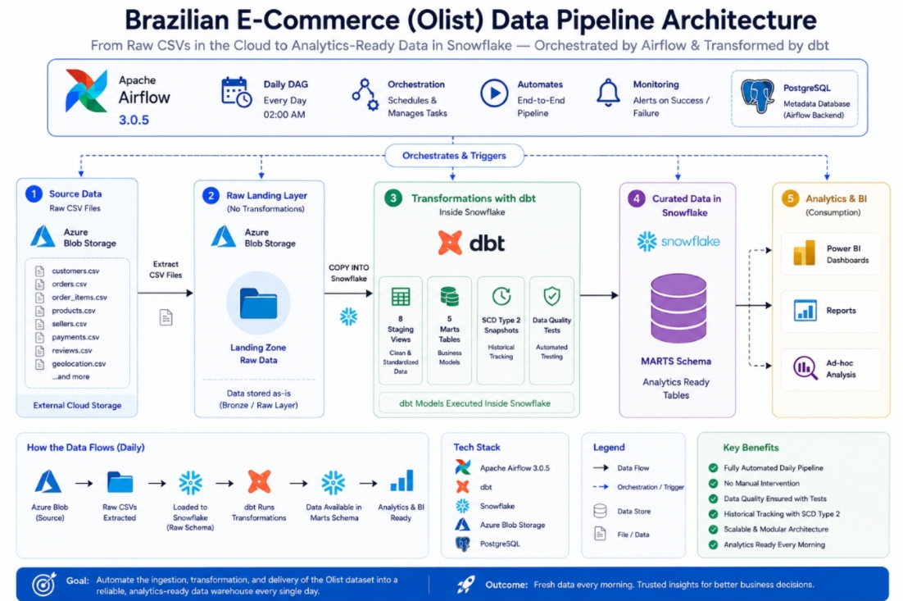

# Modern Data Stack Pipeline — Olist E-Commerce

A production-grade batch ETL pipeline that ingests the **Brazilian E-Commerce (Olist)** dataset from Azure Blob Storage into **Snowflake**, transforms it with **dbt**, and orchestrates everything with **Apache Airflow 3.x** — all running in Docker.

---

## Architecture



---

## Directory Structure

```
pipeline_modern_stack/
├── airflow_ym/               # Airflow 3.x — Docker Compose stack
│   ├── docker-compose.yml    # 4 services: postgres, apiserver, scheduler, dag-processor
│   ├── dockerfile            # Custom image (Airflow 3.0.5, Snowflake provider, dbt venv)
│   ├── .env                  # Snowflake credentials (gitignored)
│   └── dags/
│       └── talabat_batch.py  # Main DAG — COPY INTO + dbt build
│
├── dbd_ym/                   # dbt project & Snowflake infrastructure
│   ├── dbt_my/               # dbt project (staging → marts → analyses)
│   │   ├── dbt_project.yml
│   │   ├── models/
│   │   │   ├── staging/      # 8 staging views (view, STAGING schema)
│   │   │   │   ├── source.yml          # Source declarations with tests
│   │   │   │   ├── stg_customers.sql
│   │   │   │   ├── stg_geolocation.sql
│   │   │   │   ├── stg_order_items.sql
│   │   │   │   ├── stg_order_payments.sql
│   │   │   │   ├── stg_order_reviews.sql
│   │   │   │   ├── stg_orders.sql
│   │   │   │   ├── stg_products.sql
│   │   │   │   └── stg_sellers.sql
│   │   │   └── marts/        # 5 marts tables (table, MARTS schema)
│   │   │       ├── dim_customers.sql
│   │   │       ├── dim_sellers.sql
│   │   │       ├── dim_products.sql
│   │   │       ├── dim_geolocation.sql
│   │   │       ├── fct_orders.sql
│   │   │       └── fct_order_items.sql
│   │   ├── analyses/         # Reusable analytical queries
│   │   │   ├── seller_performance.sql
│   │   │   ├── product_category_analysis.sql
│   │   │   └── order_revenue_by_month.sql
│   │   ├── snapshots/
│   │   │   └── orders_snapshot.sql  # SCD Type 2 on order status/dates
│   │   └── macros/
│   │       └── schemas.sql          # Custom schema generation macro
│   └── snowflake/            # Snowflake infrastructure (run sequentially)
│       ├── 1_setup.sql              # Warehouse, DB, schemas, role
│       ├── 2_storage_integration.sql # Azure Blob Storage integration
│       ├── 3_stage_and_formats.sql  # CSV file format + external stage
│       ├── 4_raw_tables.sql         # 8 RAW table DDLs
│       └── 5_copy_into.sql          # Manual COPY INTO commands
│
├── logs/                     # Log output directory (gitignored)
├── .gitignore
├── LICENSE                   # MIT License
└── README.md
```

---

## Technologies

| Technology | Version | Role |
|---|---|---|
| **Apache Airflow** | 3.0.5 | Workflow orchestration |
| **dbt** | 1.8.x | Data transformation (ELT) |
| **Snowflake** | — | Cloud data warehouse |
| **Azure Blob Storage** | — | Data lake / source files |
| **PostgreSQL** | 16 | Airflow metadata database |
| **Docker / Docker Compose** | — | Containerization |
| **Python** | 3.12 | Airflow, dbt, custom operators |

---

**Snowflake Infrastructure (run in order)**

Execute these SQL scripts sequentially against your Snowflake account (using the Snowflake web UI or CLI):

1. **`dbd_ym/snowflake/1_setup.sql`** — Creates warehouse (`TALABAT_WH`), database (`TALABAT`), schemas (`RAW`, `STAGING`, `MARTS`, `SNAPSHOTS`), and a `DBT_ROLE` with full privileges.
2. **`dbd_ym/snowflake/2_storage_integration.sql`** — Creates a storage integration to Azure Blob Storage (fill in your `AZURE_TENANT_ID` and `STORAGE_ALLOWED_LOCATIONS`).
3. **`dbd_ym/snowflake/3_stage_and_formats.sql`** — Creates the CSV file format (`CSV_FMT`) and external stage (`TALABAT_STAGE`) pointing to your Azure Blob URL.
4. **`dbd_ym/snowflake/4_raw_tables.sql`** — Creates the 8 raw tables in `TALABAT.RAW`.
5. **`dbd_ym/snowflake/5_copy_into.sql`** — One-time manual data load into the 8 raw tables.

### 3. Configure Airflow environment

Create `airflow_ym/.env`:

```env
SNOWFLAKE_ACCOUNT=your_account.region.cloud
SNOWFLAKE_USER=3BTAWAB1
SNOWFLAKE_PASSWORD=your_password
```

### 4. Configure dbt profile

Create `dbd_ym/dbt_my/profiles.yml`:

```yaml
trans_load:
  target: dev
  outputs:
    dev:
      type: snowflake
      account: "{{ env_var('SNOWFLAKE_ACCOUNT') }}"
      user: "{{ env_var('SNOWFLAKE_USER') }}"
      password: "{{ env_var('SNOWFLAKE_PASSWORD') }}"
      role: DBT_ROLE
      database: TALABAT
      warehouse: TALABAT_WH
      schema: staging
      threads: 4
```

### 5. Start the Airflow stack

```bash
cd airflow_ym
docker compose build
docker compose up -d
```

The DAG (`talabat_batch`) will start running automatically on its `@daily` schedule. You can also trigger it manually from the UI.

---

## Pipeline Breakdown

### DAG: `talabat_batch`

Runs **daily** with two tasks:

#### Task 1: `reload_raw` (PythonOperator)

Uses `snowflake.connector` to `COPY INTO` 8 raw tables from the Azure external stage:

| Raw Table | Source File |
|---|---|
| `OLIST_CUSTOMER_DATASET` | `olist_customers_dataset.csv` |
| `OLIST_GEOLOCATION_DATASET` | `olist_geolocation_dataset.csv` |
| `OLIST_ORDER_ITEMS_DATASET` | `olist_order_items_dataset.csv` |
| `OLIST_ORDER_PAYMENTS_DATASET` | `olist_order_payments_dataset.csv` |
| `OLIST_ORDER_REVIEWS_DATASET` | `olist_order_reviews_dataset.csv` |
| `OLIST_ORDERS_DATASET` | `olist_orders_dataset.csv` |
| `OLIST_PRODUCTS_DATASET` | `olist_products_dataset.csv` |
| `OLIST_SELLERS_DATASET` | `olist_sellers_dataset.csv` |

#### Task 2: `dbt_build_core` (BashOperator)

Runs `dbt build` which executes:

- **8 staging views** — Light transformation (type casting, trimming, lowercasing) on raw data
- **5 marts tables** — Analytical model:
  - `dim_customers`
  - `dim_sellers`
  - `dim_products`
  - `dim_geolocation`
  - `fct_orders` — joins orders with aggregated payments & reviews, computes `delivery_days` and `delivery_delay_days`
  - `fct_order_items` — enriches line items with customer, order status, and `total_item_value`
- **Data quality tests** — `unique` and `not_null` constraints on key columns
- **SCD Type 2 snapshot** — Tracks historical changes to `order_status`, `order_delivered_carrier_date`, and `order_delivered_customer_date`

---

## Data Model

### Snowflake Schemas

| Schema | Purpose | Objects |
|---|---|---|
| `RAW` | Landing zone — data as-is from source | 8 raw tables |
| `STAGING` | Lightly transformed, typed data | 8 staging views |
| `MARTS` | Business-ready dimensional model | 4 dims + 2 facts |
| `SNAPSHOTS` | Slow-changing dimension history | `orders_snapshot` |

### dbt Lineage

```
RAW tables (source)
  └─ stg_* views (staging)
      ├─ dim_customers, dim_sellers, dim_products, dim_geolocation
      ├─ fct_orders  ← stg_orders + stg_order_payments + stg_order_reviews
      ├─ fct_order_items ← stg_order_items + stg_orders
      └─ orders_snapshot ← stg_orders (SCD Type 2)
```

---

## Built-in Analyses

Three analytical queries are included under `dbd_my/analyses/` that can be compiled and run via `dbt compile` or manually:

| Analysis | Description |
|---|---|
| `seller_performance.sql` | Top 100 sellers by revenue, including order count, unique products, avg order value |
| `product_category_analysis.sql` | Sales, weight, and volume metrics by product category |
| `order_revenue_by_month.sql` | Monthly revenue, delivery days, and average review scores |

---

## Notes

- dbt runs from its own isolated virtual environment at `/opt/airflow/dbt_venv/bin/dbt` inside the Airflow container to avoid dependency conflicts.
- The `.env` files are gitignored — never commit credentials.

## License

MIT © 2026 Yousef Abdeltawab
